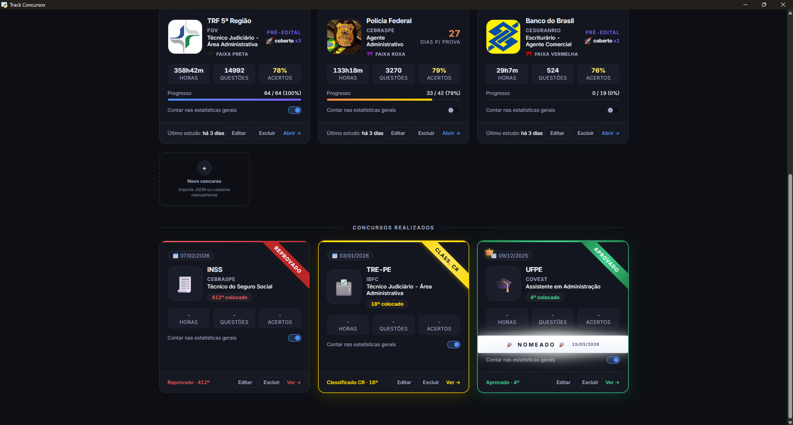
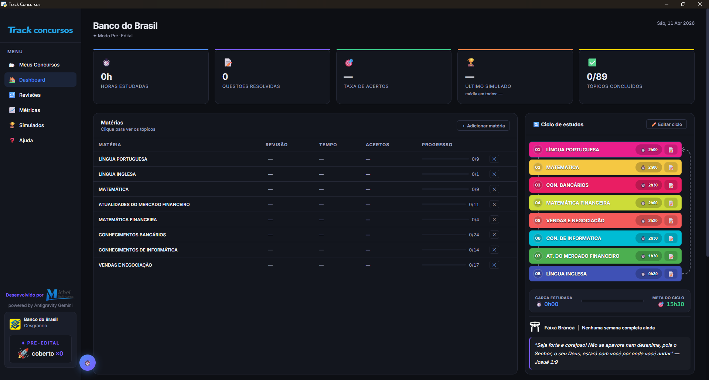
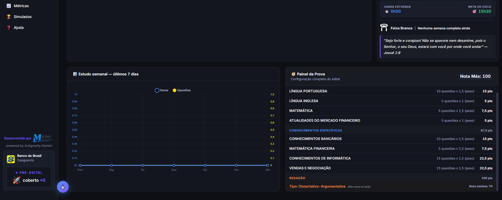
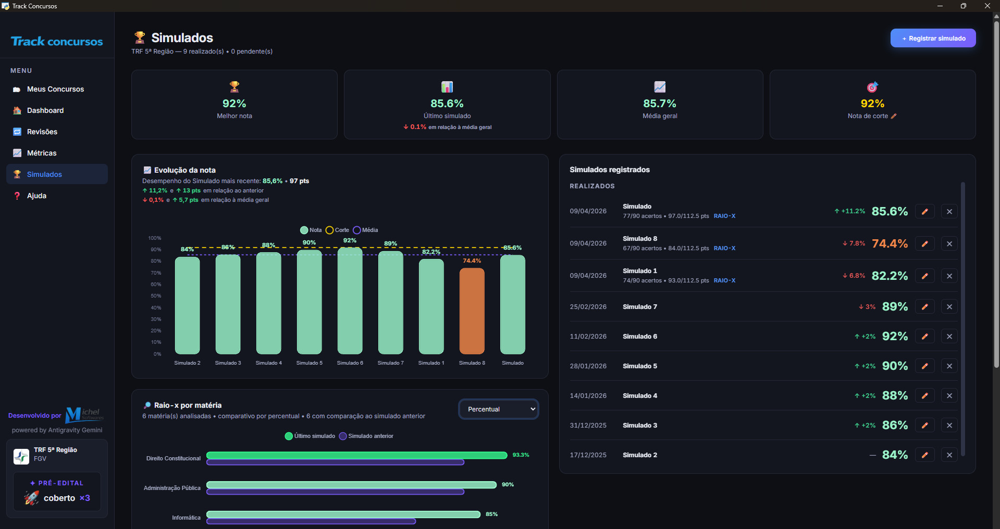

<p align="center">
  
</p>

<p align="center">
  
</p>

<p align="center">
  Aplicativo desktop para organizar estudos para concursos com foco em pré e pós-edital,
  registrar sua rotina diária de estudos, sugerir revisões, analisar simulados e seu desempenho de estudo.
</p>

<p align="center">
  <a href="#requisitos-para-instalacao"></a>
  <a href="#instalacao"></a>
  <a href="https://www.youtube.com/watch?v=YrqFyPrqRSQ"></a>
  <a href="https://github.com/michel-softwares/track-concursos/releases/tag/v1.0.6"></a>
  <a href="#licenca-de-uso"></a>
</p>

<p align="center">
  
  
</p>

<p align="center">
  
  
</p>

<p align="center">
  
</p>

**Track Concursos** é um aplicativo desktop criado para organizar a rotina de estudos para concursos públicos, desde o planejamento do pré-edital até a análise pós-prova, reunindo organização do seu material de estudo, execução e acompanhamento de desempenho em uma única experiência local e gratuita.

## Sumário

- [Por Que Este Projeto Existe](#por-que-este-projeto-existe)
- [Principais Funcionalidades](#principais-funcionalidades)
- [Manual de uso inicial](#manual-de-uso-inicial)
  - [Instalação](#instalação)
  - [Como Abrir o Programa](#como-abrir-o-programa)
- [Estrutura do Projeto](#estrutura-do-projeto)
- [Dados e Portabilidade](#dados-e-portabilidade)
- [Licença de Uso](#licença-de-uso)
- [Sobre o Desenvolvimento](#sobre-o-desenvolvimento)
- [Apoie o projeto](#apoie-o-projeto)
- [Contato e comunidade](#comunidade)

---

## Por Que Este Projeto Existe

Este projeto propõe uma solução gratuita para o planejamento de estudos para concursos públicos, os quais costumam ficar espalhados entre várias planilhas diferentes. Com o **Track Concursos**, você reúne todos os seus estudos em um só lugar, além de contar com uma análise detalhada do seu desempenho e o acompanhamento de concursos que já foram realizados.


## Principais Funcionalidades

### 1. Gestão completa por concurso

Cada concurso pode armazenar:

- instituição, banca, cargo, salário, quantidade de vagas, link para o edital oficial e data da prova
- status de pré-edital, pós-edital ou concurso já realizado
- matérias, tópicos e subtópicos
- materiais linkados tópico por tópico para fácil acesso
- análise de progresso por cobertura de edital
- histórico de aprovação, reprovação e classificação CR nos concursos que já realizou

### 2. Ciclo de estudos e cronograma agendado

O programa conta cronogramas de estudos inteligentes, que analisam o painel da prova do concurso para entender as matérias de maior prioridade da prova e o desempenho do usuário em tempo real para estimar em quanto tempo cobrirá todo o edital de acordo com o ritmo de estudo diário e horário disponível. 
Existem dois modelos de planejamento:

- **Ciclo de Estudos**: baseado no método muito conhecido do mentor especialista em concursos públicos e Auditor Fiscal Alexandre Meirelles. Esse modelo é ideal para rotinas imprevisíveis de pouco tempo disponível para estudos, com sequência contínua de matérias e metas de tempo
- **Cronograma Semanal**: ideal para quem prefere organizar os estudos por dias fixos e seguir um calendário de estudos. Esse modelo sugere de forma inteligente tópicos para o usuário estudar e prioriza matérias com maior peso durante todo o calendário até a finalização do edital.

### 3. Cronômetro, pomodoro e lançamentos manuais de estudos

O app permite registrar estudo por meio de:

- cronômetro regressivo
- Pomodoro clássico
- cronômetro livre
- lançamentos manuais de horas e questões

### 4. Revisões e progresso por tópico

Ao concluir o estudo de um tópico, o usuário pode marcar dias para revisões futuras. O Cronograma Inteligente também sugere automaticamente tópicos com baixo rendimento de acertos em questões e simulados recentes para uma revisão pesada, permitindo que o usuário esteja atento aos seus pontos fracos.

### 5. Simulados com análise aprofundada

Os acertos dos seus simulados podem ser registrados manualmente e vão mostrar sua nota automaticamente a partir das informações registradas no Painel da Prova. A área de Simulados oferece estatísticas precisas como:

- sua evolução da nota
- comparação com o simulado anterior
- comparação com a média geral
- raio-x por matéria
- análise dos pontos fortes e das maiores dificuldades

### 6. Edital Premium

**Editais Premium são estruturas completas para determinados concursos (possuem todos os tipos de informações necessárias para o usuário começar a estudar sem perder tempo como edital com todo conteúdo programático da prova verticalizado, painel de prova preenchido, materiais de estudos linkados e etc)**. O programa suporta importação de estruturas prontas em JSON, incluindo:

- matérias, tópicos e subtópicos 
- painel da prova
- informações do edital como vagas, salário, cargo, banca, link do edital
- simulados vinculados
- configurações estruturais do concurso
- e também materiais linkados (videoaulas, PDFs online, links dos seus cursinhos, cadernos de questões)

> [!TIP]
> É possível importar um Edital Premium completo com materiais linkados tópico por tópico, acesse a aba de Editais Premium da aplicação e pesquise por Editais Premium Completos. Você também pode encontrar no site https://track-concursos.github.io/#/editais 

### 7. Perfis separados e backups locais

Mais de uma pessoa pode usar o programa no mesmo computador sem misturar os dados e estatísticas, a aplicação conta com a criação de Perfis e cada um possui sua estrutura de dados separada.

Todos os arquivos são salvos localmente e arquivos de perfis e backup ficam em pastas separadas da pasta principal onde a aplicação é instalada, portanto é perfeitamente seguro instalar outras versões por cima sem perder os Perfis com estatísticas do usuário.

---

## Instalação

<h2 id="requisitos-para-instalacao">Requisitos para Instalação</h2>

Para a forma recomendada de uso, você precisa de:

- Windows 10 ou Windows 11
- Microsoft Edge WebView2 Runtime instalado

O WebView2 já vem instalado em muitos computadores. Se ele não estiver presente no seu, o instalador ou o próprio aplicativo vão avisar e orientar o download oficial. Baixe aqui: https://go.microsoft.com/fwlink/p/?LinkId=2124703

### Tutorial em vídeo

Veja o tutorial no youtube para fácil instalação e como usar a aplicação. 
*PS: o tutorial contempla a instalação da versão 1.0.1 mas ainda segue o mesmo padrão, basta baixar e instalar a versão mais atual disponível.*

<p align="center">
  <a href="https://www.youtube.com/watch?v=YrqFyPrqRSQ">
    
  </a>
</p>

<p align="center">
  <a href="https://www.youtube.com/watch?v=YrqFyPrqRSQ"><strong>Assistir tutorial de instalação no YouTube</strong></a>
</p>


### 1. Baixando o instalador pelo site

1. Entre no site da aplicação Track-Concursos.github.io 
2. Clique no botão `baixar versão mais atual`.
3. O arquivo `TrackConcursos-Setup-[versão atual].exe` será baixado, atenção se o seu navegador alertar que não é seguro o download de um programa desconhecido ignore e escolha baixar o arquivo. Todo código-fonte da aplicação está disponível aqui para análise e é seguro, possui centenas de downloads.

### 2. Executando o instalador

1. Vá até a pasta onde seu arquivo foi baixado.
2. Dê duplo clique em `TrackConcursos-Setup-[versão atual].exe`. Atenção, o Windows pode bloquear a execução do instalador por não ter assinatura, basta clicar em `Mais Informações` e `Executar Mesmo Assim`
3. Siga as etapas do assistente até concluir a instalação.
4. Abra o programa pelo atalho criado no menu Iniciar ou na Área de Trabalho.


## Como Abrir o Programa

Se você instalou o programa através do instalador:

- abra o atalho `Track Concursos` criado pelo instalador na sua área de trabalho

---

## Estrutura do Projeto

```text
Track Concursos/
|-- Track Concursos.pyw
|-- track_concursos_app.py
|-- requirements.txt
|-- README.md
|-- LICENSE
|-- backups/
|-- profiles/
|-- www/
|-- installer/
|-- docs/
`-- build-resources/
```

| Caminho | Função |
|---|---|
| `Track Concursos.pyw` | launcher principal |
| `track_concursos_app.py` | núcleo desktop do aplicativo |
| `www/` | interface HTML, CSS e JavaScript |
| `profiles/` | perfis locais do usuário no modo manual/portátil |
| `backups/` | backups e snapshots locais no modo manual/portátil |
| `installer/` | arquivos do instalador Windows |
| `docs/` | documentação de empacotamento e release |
| `build-resources/` | ícones e imagens usadas no build |

---

## Dados e Portabilidade

Quando o programa é instalado pelo `.exe`, os dados do usuário ficam salvos em:

```text
%LOCALAPPDATA%\Track Concursos
```

Isso inclui:

- perfis
- concursos
- backups
- configurações auxiliares
- logos e arquivos complementares

Os snapshots de segurança dos perfis ficam em `profiles/<perfil>/snapshots`.
O app limpa snapshots antigos automaticamente ao salvar: mantém sempre os 20
mais recentes e também 1 snapshot por dia dos últimos 30 dias. A limpeza atua
somente em arquivos `.json` dentro da pasta `snapshots` de cada perfil.

---


<h2 id="licenca-de-uso">Licença de Uso</h2>

O Track Concursos é disponibilizado gratuitamente para **uso pessoal e não comercial**.

Sem autorização prévia e por escrito do autor, não é permitido:

- modificar o software
- redistribuir versões originais ou alteradas
- vender, revender, sublicenciar ou explorar comercialmente o programa
- comercializar conteúdos premium vinculados ao projeto

Consulte [LICENSE](LICENSE) para os termos completos.

---

## Sobre o Desenvolvimento

O projeto foi idealizado por mim e desenvolvido com apoio de ferramentas de inteligência artificial.

Tecnologias utilizadas:

- Linguagens: HTML, CSS, JavaScript e Python
- Claude Sonnet 4.5: utilizado no início do projeto [1.0.0]
- Antigravity Gemini 3 Flash e Gemini 3.1 Pro: utilizados em grande parte do desenvolvimento inicial [1.0.0 a 1.0.1]
- openAI Codex GPT-5.4 e 5.5: utilizado em correções, melhorias e nas novas atualizações [1.0.1 - versões atuais]

No processo de empacotamento da versão Windows, o projeto também utiliza:

- PyInstaller
- Inno Setup

---


## Apoie o projeto

O **Track Concursos** é gratuito para uso pessoal. 

Se ele foi útil para você peço que deixe uma Star no repositório, isso me incentiva a continuar com atualizações. Se você deseja que o projeto se expanda para outras plataformas como mobile ou web, considere apoiar via PIX para viabilizar esses projetos.

### Contato

- WhatsApp: [falar comigo](https://api.whatsapp.com/send?phone=5589981383459&text=Ol%C3%A1,%20estou%20interessado%20em%20um%20Edital%20Premium%20para%20o%20Track%20Concursos)
- E-mail: `michel.araujo.py@gmail.com`
- Chave Pix: `michelaraujo100@gmail.com`

QR Code Pix

<p>
  
</p>

---


## Comunidade

Sugestões, feedbacks, avisos de bugs e dúvidas são sempre bem-vindos. Também estou disponível para tirar dúvidas e auxiliar no uso do programa no grupo do Telegram. Sinta-se à vontade para pedirem estruturas de concursos específicos prontas, disponibilizarei gratuitamente.

- [Grupo no Telegram](https://t.me/+nlYaAYBFTYs4YTYx)

Você também pode falar comigo diretamente por:

- WhatsApp: [falar comigo](https://api.whatsapp.com/send?phone=5589981383459&text=Ol%C3%A1,%20estou%20interessado%20em%20um%20Edital%20Premium%20para%20o%20Track%20Concursos)
- E-mail: `michel.araujo.py@gmail.com`

---

Para uso normal, abra sempre o atalho instalado do `Track Concursos` ou, no modo manual, `Track Concursos.pyw`.
# concursos
# concursos
